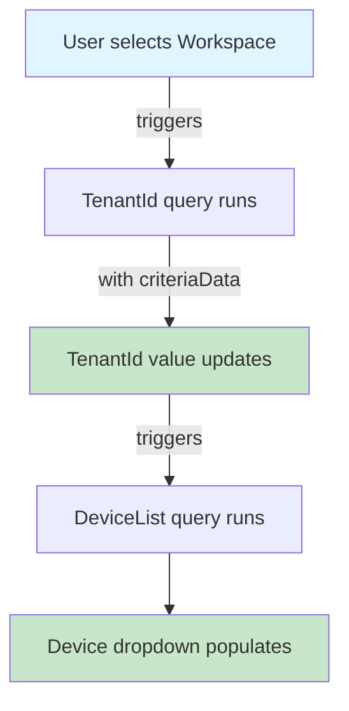

# Parameter Dependency Flow - Visual Guide

## How Parameter Autopopulation Works

### The Dependency Chain



### FileOperations.workbook - Before Fix ❌

```
┌─────────────────┐
│ User Action:    │
│ Select          │
│ Workspace       │
└────────┬────────┘
         │
         ▼
┌─────────────────────────────────┐
│ TenantId Parameter              │
│ ❌ NO criteriaData               │
│ ❌ Query doesn't re-run          │
│ Result: Empty or stale value    │
└─────────────────────────────────┘

┌─────────────────────────────────┐
│ FunctionAppName Parameter       │
│ ❌ value: "__PLACEHOLDER__"     │
│ Result: Can't enter real name   │
└─────────────────────────────────┘
```

### FileOperations.workbook - After Fix ✅

```
┌─────────────────┐
│ User Action:    │
│ Select          │
│ Workspace       │
└────────┬────────┘
         │
         ▼
┌─────────────────────────────────┐
│ TenantId Parameter              │
│ ✅ HAS criteriaData → Workspace │
│ ✅ Query re-runs automatically   │
│ Result: Auto-populated GUID     │
└────────┬────────────────────────┘
         │
         ▼
┌─────────────────────────────────┐
│ DeviceList Parameter            │
│ ✅ HAS criteriaData → TenantId  │
│ ✅ Refreshes when TenantId set  │
│ Result: Device list populates   │
└─────────────────────────────────┘

┌─────────────────────────────────┐
│ FunctionAppName Parameter       │
│ ✅ NO placeholder value          │
│ Result: Empty, ready for input  │
└─────────────────────────────────┘
```

## Code Comparison

### TenantId Parameter

#### ❌ Before (Missing criteriaData)
```json
{
  "name": "TenantId",
  "query": "Resources | where id == '{Workspace}' | ...",
  "queryType": 1,
  "description": "Auto-discovered from Log Analytics Workspace..."
}
```

#### ✅ After (With criteriaData)
```json
{
  "name": "TenantId",
  "query": "Resources | where id == '{Workspace}' | ...",
  "queryType": 1,
  "description": "Auto-discovered from Log Analytics Workspace...",
  "criteriaData": [
    {
      "criterionType": "param",
      "value": "{Workspace}"
    }
  ]
}
```

### FunctionAppName Parameter

#### ❌ Before (Placeholder value)
```json
{
  "name": "FunctionAppName",
  "type": 1,
  "isRequired": true,
  "value": "__FUNCTION_APP_NAME_PLACEHOLDER__",
  "description": "Enter your DefenderC2 function app name..."
}
```

#### ✅ After (No placeholder)
```json
{
  "name": "FunctionAppName",
  "type": 1,
  "isRequired": true,
  "description": "Enter your DefenderC2 function app name..."
}
```

## Full Dependency Graph

### DefenderC2-Workbook.json (Already correct ✅)

```
┌──────────────────┐
│  FunctionApp     │ ◄── User selects from dropdown
│  (Resource)      │
└────────┬─────────┘
         │
         ├──────────────────────────────┐
         │                              │
         ▼                              ▼
┌──────────────────┐         ┌──────────────────┐
│  Subscription    │         │  ResourceGroup   │
│  (Auto)          │         │  (Auto)          │
└────────┬─────────┘         └──────────────────┘
         │                              │
         │                              ▼
         │                   ┌──────────────────┐
         │                   │ FunctionAppName  │
         │                   │ (Auto)           │
         │                   └────────┬─────────┘
         │                            │
         ▼                            │
┌──────────────────┐                 │
│  TenantId        │                 │
│  (Auto)          │                 │
└────────┬─────────┘                 │
         │                            │
         └────────────┬───────────────┘
                      │
                      ▼
            ┌──────────────────┐
            │  DeviceList      │
            │  (Auto-populate) │
            └──────────────────┘
```

### FileOperations.workbook (Fixed ✅)

```
┌──────────────────┐
│  Subscription    │ ◄── User selects
└────────┬─────────┘
         │
         ▼
┌──────────────────┐
│  Workspace       │ ◄── User selects
└────────┬─────────┘
         │
         ▼
┌──────────────────┐
│  TenantId        │
│  (Auto) ✅        │ ◄── NOW HAS criteriaData
└──────────────────┘

┌──────────────────┐
│ FunctionAppName  │ ◄── User enters manually
│ (Manual) ✅       │ ◄── NO MORE PLACEHOLDER
└──────────────────┘
```

## Why This Matters

### Without criteriaData
```
User selects Workspace → TenantId query runs ONCE at page load
                      → Doesn't know Workspace changed
                      → Shows wrong/empty value
                      → User confused 😞
```

### With criteriaData
```
User selects Workspace → Workbook sees criteriaData
                      → Re-runs TenantId query with new Workspace
                      → TenantId updates automatically
                      → Triggers DeviceList update
                      → Everything works 😊
```

## Key Takeaway

**The `criteriaData` field is the "trigger" that tells Azure Workbooks when to refresh a parameter.**

Without it, parameters only run once and never update when their dependencies change.

---

**Status**: Issue resolved ✅  
**Files modified**: 1 (workbook/FileOperations.workbook)  
**Lines changed**: +7 lines added, -1 line removed
