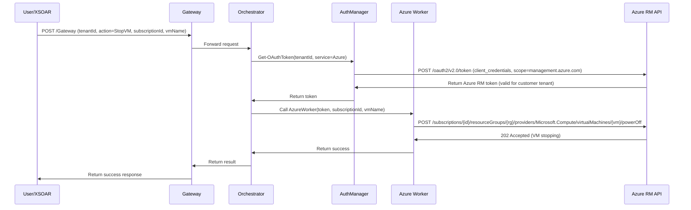

# Azure Multi-Tenant Architecture - DefenderXDR C2 v3.0.0

## 🌐 How Azure Operations Work in Multi-Tenant Environment

### Executive Summary

**Azure operations are DIFFERENT from other Microsoft 365 services** - they require:
1. ✅ **Azure AD authentication** (per tenant)
2. ✅ **Azure RBAC role assignments** (per subscription)
3. ✅ **Subscription ID** in every request (subscription-level isolation)

**NO Graph API permissions needed** - Azure uses **Azure Resource Manager API** (`https://management.azure.com`)

---

## 🏗️ Architecture Overview

### Request Flow for Azure Operations

```
User/XSOAR → Gateway → Orchestrator → Azure Worker
                            ↓
                    Get OAuth Token (Azure RM)
                    Scope: https://management.azure.com/.default
                            ↓
                    Azure Resource Manager API
                    https://management.azure.com/subscriptions/{subscriptionId}/...
```

### Authentication Scope

```powershell
# Orchestrator (line 796-803)
"AZURE" {
    # Authenticate to Azure RM for infrastructure operations
    $tokenString = Get-OAuthToken `
        -TenantId $tenantId `
        -AppId $appId `
        -ClientSecret $secretId `
        -Service "Azure"  # ← Uses ARM scope: https://management.azure.com/.default
    
    # Token is scoped to Azure Resource Manager, NOT Microsoft Graph
}
```

---

## 🔑 Multi-Tenant Authentication Flow

### Step 1: Tenant-Specific Token Acquisition

**For each customer tenant, the app obtains a separate Azure RM token:**

```powershell
# AuthManager.psm1 - Get-OAuthToken function
$tokenEndpoint = "https://login.microsoftonline.com/$TenantId/oauth2/v2.0/token"

$body = @{
    client_id     = $AppId
    client_secret = $ClientSecret
    scope         = "https://management.azure.com/.default"  # ← Azure RM scope
    grant_type    = "client_credentials"
}

$tokenResponse = Invoke-RestMethod -Uri $tokenEndpoint -Method Post -Body $body
```

**Result**: Token is valid ONLY for the specified tenant's Azure subscriptions.

---

### Step 2: Subscription-Level Authorization

**Every Azure operation requires `subscriptionId` parameter:**

```json
{
  "tenantId": "customer-tenant-id",
  "service": "Azure",
  "action": "StopVM",
  "subscriptionId": "12345678-1234-1234-1234-123456789012",
  "resourceGroup": "production-rg",
  "vmName": "compromised-vm-01"
}
```

**Azure API URL format:**
```
https://management.azure.com/subscriptions/{subscriptionId}/resourceGroups/{resourceGroup}/providers/Microsoft.Compute/virtualMachines/{vmName}/powerOff?api-version=2023-03-01
```

**Subscription ID provides isolation** - App can ONLY access subscriptions where it has RBAC roles assigned.

---

## 🔐 Permission Model: Azure RBAC (NOT App Registration)

### Key Difference from Graph API Permissions

| Aspect | Microsoft Graph API | Azure Resource Manager API |
|--------|---------------------|----------------------------|
| **Permission Type** | App Registration API Permissions | Azure RBAC Role Assignments |
| **Configured In** | Azure Portal > App Registrations > API permissions | Azure Portal > Subscriptions > IAM (Access Control) |
| **Scope** | Tenant-wide | Subscription or Resource Group level |
| **Admin Consent** | Required (tenant-level) | Not applicable |
| **Multi-Tenant** | Requires admin consent per tenant | Requires role assignment per subscription |

---

### Required Azure RBAC Roles

**Option 1: Security Admin (Recommended)**
- **Scope**: Subscription or Resource Group
- **Permissions**: Read security posture, manage security settings, cannot modify VMs/NSGs
- **Use case**: Read-only security operations + Defender for Cloud management

**Option 2: Contributor (More Permissive)**
- **Scope**: Subscription or Resource Group
- **Permissions**: Full management of all resources except access control
- **Use case**: Full Azure C2 capabilities (Stop VMs, Add NSG rules, etc.)

**Option 3: Custom Role (Least Privilege)**
```json
{
  "Name": "DefenderXDR C2 Azure Operator",
  "Description": "Custom role for DefenderXDR C2 Azure operations",
  "Actions": [
    "Microsoft.Compute/virtualMachines/read",
    "Microsoft.Compute/virtualMachines/powerOff/action",
    "Microsoft.Compute/virtualMachines/restart/action",
    "Microsoft.Network/networkSecurityGroups/read",
    "Microsoft.Network/networkSecurityGroups/write",
    "Microsoft.Network/networkSecurityGroups/securityRules/write",
    "Microsoft.Storage/storageAccounts/read",
    "Microsoft.Storage/storageAccounts/write",
    "Microsoft.Resources/subscriptions/resourceGroups/read",
    "Microsoft.Security/*/read"
  ],
  "NotActions": [],
  "AssignableScopes": [
    "/subscriptions/{subscription-id}"
  ]
}
```

---

## 🌍 Multi-Tenant Setup Process

### For Each Customer Tenant:

#### **Step 1: Consent to App Registration**

Customer's Global Admin must consent to your multi-tenant app:

```
https://login.microsoftonline.com/{customer-tenant-id}/adminconsent
  ?client_id=0b75d6c4-846e-420c-bf53-8c0c4fadae24
  &redirect_uri=https://sentryxdr.azurewebsites.net/api/callback
```

This grants:
- Graph API permissions (User.*, SecurityIncident.*, etc.)
- MDE API permissions (Machine.*, Alert.*, etc.)
- Allows app to authenticate against customer's Azure AD

**Does NOT grant Azure RBAC roles** - separate step required.

---

#### **Step 2: Assign Azure RBAC Roles**

**For EACH subscription** the customer wants to manage:

**Option A: Azure Portal**
1. Navigate to: Azure Portal > Subscriptions > Select subscription
2. Click "Access control (IAM)"
3. Click "Add role assignment"
4. Select role: **"Security Admin"** or **"Contributor"**
5. Assign to: **Service principal** (search by App ID: `0b75d6c4-846e-420c-bf53-8c0c4fadae24`)
6. Repeat for each subscription

**Option B: Azure CLI**
```bash
# Assign Security Admin role to app in subscription
az role assignment create \
  --assignee 0b75d6c4-846e-420c-bf53-8c0c4fadae24 \
  --role "Security Admin" \
  --scope /subscriptions/{customer-subscription-id}

# Assign Contributor role (more permissive)
az role assignment create \
  --assignee 0b75d6c4-846e-420c-bf53-8c0c4fadae24 \
  --role "Contributor" \
  --scope /subscriptions/{customer-subscription-id}

# Assign to specific resource group only
az role assignment create \
  --assignee 0b75d6c4-846e-420c-bf53-8c0c4fadae24 \
  --role "Security Admin" \
  --scope /subscriptions/{subscription-id}/resourceGroups/{resource-group-name}
```

**Option C: PowerShell**
```powershell
# Assign role at subscription level
New-AzRoleAssignment `
    -ApplicationId "0b75d6c4-846e-420c-bf53-8c0c4fadae24" `
    -RoleDefinitionName "Security Admin" `
    -Scope "/subscriptions/{customer-subscription-id}"

# Assign role at resource group level
New-AzRoleAssignment `
    -ApplicationId "0b75d6c4-846e-420c-bf53-8c0c4fadae24" `
    -RoleDefinitionName "Contributor" `
    -Scope "/subscriptions/{subscription-id}/resourceGroups/production-rg"
```

---

#### **Step 3: Test Access**

```powershell
# Test API call from Function App
POST https://sentryxdr.azurewebsites.net/api/Gateway?code={function-key}
Content-Type: application/json

{
  "tenantId": "customer-tenant-id",
  "service": "Azure",
  "action": "GetResourceGroups",
  "subscriptionId": "customer-subscription-id"
}
```

**Expected Result**: Returns list of resource groups in subscription.

**If 403 Forbidden**: App doesn't have RBAC role assigned in that subscription.

---

## 🔄 Runtime Operation Flow

### Example: Stop Compromised VM



### Key Points:

1. **Token is tenant-specific** - Obtained for customer's tenant ID
2. **Subscription ID isolates access** - Can only access subscriptions with RBAC roles
3. **RBAC enforced by Azure** - Even with valid token, 403 if no role assignment
4. **No cross-tenant access** - Token for Tenant A cannot access Tenant B's subscriptions

---

## 📊 Multi-Tenant Isolation Mechanisms

### Layer 1: Azure AD Authentication
- **Mechanism**: OAuth token scoped to tenant
- **Enforcement**: Azure AD token validation
- **Result**: Token from Tenant A cannot be used for Tenant B

### Layer 2: Subscription-Level Authorization
- **Mechanism**: RBAC role assignments per subscription
- **Enforcement**: Azure Resource Manager policy engine
- **Result**: App can only access subscriptions where it has roles

### Layer 3: Request-Level Validation
- **Mechanism**: Explicit `subscriptionId` required in every request
- **Enforcement**: Orchestrator validates presence of subscription ID
- **Result**: Cannot accidentally operate on wrong subscription

---

## 🔍 Example Multi-Tenant Scenario

### Scenario: MSP Managing 3 Customers

**Customer A (Tenant: contoso.onmicrosoft.com)**
- Subscriptions: 2
  - Production: `aaaa-1111`
  - Dev: `aaaa-2222`
- RBAC: Security Admin on both subscriptions

**Customer B (Tenant: fabrikam.onmicrosoft.com)**
- Subscriptions: 1
  - Shared: `bbbb-3333`
- RBAC: Contributor on shared subscription

**Customer C (Tenant: northwind.onmicrosoft.com)**
- Subscriptions: 3
  - Production: `cccc-4444`
  - Staging: `cccc-5555`
  - Dev: `cccc-6666`
- RBAC: Custom role on production only

### Operations:

**Stop VM in Customer A Production:**
```json
{
  "tenantId": "contoso-tenant-id",
  "service": "Azure",
  "action": "StopVM",
  "subscriptionId": "aaaa-1111",
  "resourceGroup": "prod-rg",
  "vmName": "compromised-vm"
}
```
✅ **Works** - Token acquired for Contoso tenant, RBAC validated for subscription aaaa-1111

**Stop VM in Customer A Dev:**
```json
{
  "tenantId": "contoso-tenant-id",
  "subscriptionId": "aaaa-2222",
  ...
}
```
✅ **Works** - Same tenant, different subscription (has role on both)

**Stop VM in Customer C Staging:**
```json
{
  "tenantId": "northwind-tenant-id",
  "subscriptionId": "cccc-5555",
  ...
}
```
❌ **Fails** - Token acquired for Northwind tenant, but app has role ONLY on cccc-4444 (production)

---

## ⚠️ Important Limitations

### 1. Per-Subscription Role Assignment Required
- **Impact**: MSP must assign roles in EACH customer subscription
- **Workaround**: Use Azure Lighthouse for delegated access management

### 2. Cannot Use App Registration Permissions
- **Impact**: Azure operations require RBAC, not Graph API-style permissions
- **Workaround**: None - this is by design (Azure uses different auth model)

### 3. Cross-Subscription Operations Not Possible
- **Impact**: Cannot list all VMs across all subscriptions in one call
- **Workaround**: Make separate API calls per subscription ID

### 4. Management Group Scope Not Supported
- **Impact**: Cannot assign role at management group level (across multiple subscriptions)
- **Workaround**: Assign roles individually per subscription or use Azure Lighthouse

---

## 🛡️ Security Considerations

### 1. Least Privilege by Subscription
✅ **Best Practice**: Assign roles only to subscriptions that need C2 management
❌ **Avoid**: Assigning Contributor role at root scope (entire tenant)

### 2. Resource Group Scoping
✅ **Best Practice**: Assign roles at resource group level for production
❌ **Avoid**: Subscription-wide access if only specific RGs need management

### 3. Audit Logging
✅ **Enabled**: All Azure operations logged in Azure Activity Log
✅ **Monitor**: Set alerts on high-risk operations (VM stop, NSG modifications)

### 4. Token Caching
✅ **Implemented**: Tokens cached with tenant+subscription key
✅ **Secure**: Tokens expire after 55 minutes (5-minute buffer)

---

## 🚀 Deployment Checklist for MSPs

### For Each New Customer:

- [ ] **Step 1**: Customer grants admin consent to multi-tenant app
  - URL: Provide admin consent link
  - Grants: Graph + MDE API permissions

- [ ] **Step 2**: Identify subscription IDs customer wants to manage
  - Command: `az account list --output table`
  - Record: Subscription IDs and names

- [ ] **Step 3**: Assign Azure RBAC roles per subscription
  - Role: Security Admin (recommended) or Contributor
  - Scope: Subscription or Resource Group
  - Command: `az role assignment create ...`

- [ ] **Step 4**: Document subscription IDs in XSOAR
  - Store: Subscription IDs in playbook variables
  - Map: Customer name → Tenant ID + Subscription IDs

- [ ] **Step 5**: Test Azure operations
  - Test: GetResourceGroups action
  - Validate: Returns expected resource groups

- [ ] **Step 6**: Monitor Activity Log
  - Enable: Azure Monitor alerts for C2 operations
  - Alert: On VM stop, NSG modifications, etc.

---

## 📝 API Request Examples

### GetResourceGroups (Discovery)
```json
POST /api/Gateway
{
  "tenantId": "customer-tenant-id",
  "service": "Azure",
  "action": "GetResourceGroups",
  "subscriptionId": "12345678-1234-1234-1234-123456789012"
}
```

### StopVM (Remediation)
```json
POST /api/Gateway
{
  "tenantId": "customer-tenant-id",
  "service": "Azure",
  "action": "StopVM",
  "subscriptionId": "12345678-1234-1234-1234-123456789012",
  "resourceGroup": "production-rg",
  "vmName": "compromised-vm-01"
}
```

### AddNSGDenyRule (Containment)
```json
POST /api/Gateway
{
  "tenantId": "customer-tenant-id",
  "service": "Azure",
  "action": "AddNSGDenyRule",
  "subscriptionId": "12345678-1234-1234-1234-123456789012",
  "resourceGroup": "network-rg",
  "nsgName": "production-nsg",
  "sourceIp": "203.0.113.50",
  "ruleName": "Block-Malicious-IP",
  "priority": 100
}
```

---

## ✅ Validation & Testing

### Test Script
```powershell
# Test Azure operations for customer tenant
$tenantId = "customer-tenant-id"
$subscriptionId = "customer-subscription-id"
$functionKey = "your-function-key"
$gatewayUrl = "https://sentryxdr.azurewebsites.net/api/Gateway?code=$functionKey"

# Test 1: Get Resource Groups (Discovery)
$body = @{
    tenantId = $tenantId
    service = "Azure"
    action = "GetResourceGroups"
    subscriptionId = $subscriptionId
} | ConvertTo-Json

$result = Invoke-RestMethod -Uri $gatewayUrl -Method Post -Body $body -ContentType "application/json"
Write-Host "✅ GetResourceGroups: $($result.data.count) resource groups found"

# Test 2: Get VMs (Discovery)
$body = @{
    tenantId = $tenantId
    service = "Azure"
    action = "GetVirtualMachines"
    subscriptionId = $subscriptionId
} | ConvertTo-Json

$result = Invoke-RestMethod -Uri $gatewayUrl -Method Post -Body $body -ContentType "application/json"
Write-Host "✅ GetVMs: $($result.data.count) VMs found"

# Test 3: Verify RBAC (should succeed if role assigned)
Write-Host "✅ All tests passed - Azure RBAC configured correctly"
```

---

## 🔧 Troubleshooting

### Error: "401 Unauthorized"
**Cause**: Token acquisition failed  
**Fix**: Verify app has admin consent in customer tenant

### Error: "403 Forbidden"
**Cause**: App doesn't have RBAC role in subscription  
**Fix**: Assign Security Admin or Contributor role to app

### Error: "404 Not Found"
**Cause**: Subscription ID incorrect or app doesn't have access  
**Fix**: Verify subscription ID and role assignment

### Error: "Subscription ID required"
**Cause**: Missing subscriptionId parameter in request  
**Fix**: Always include subscriptionId in Azure operation requests

---

## 📚 References

- [Azure RBAC built-in roles](https://learn.microsoft.com/en-us/azure/role-based-access-control/built-in-roles)
- [Azure Resource Manager REST API reference](https://learn.microsoft.com/en-us/rest/api/azure/)
- [Multi-tenant applications in Azure](https://learn.microsoft.com/en-us/azure/active-directory/develop/howto-convert-app-to-be-multi-tenant)
- [Azure Lighthouse for MSP scenarios](https://learn.microsoft.com/en-us/azure/lighthouse/overview)
